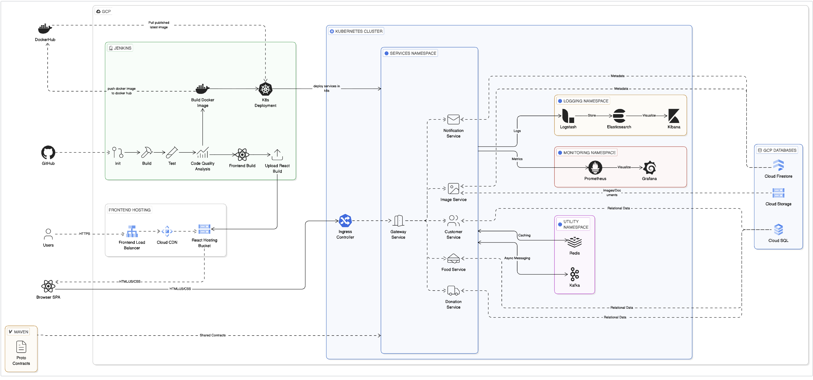
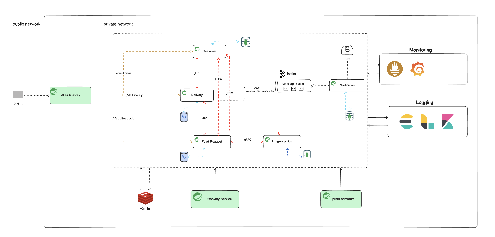
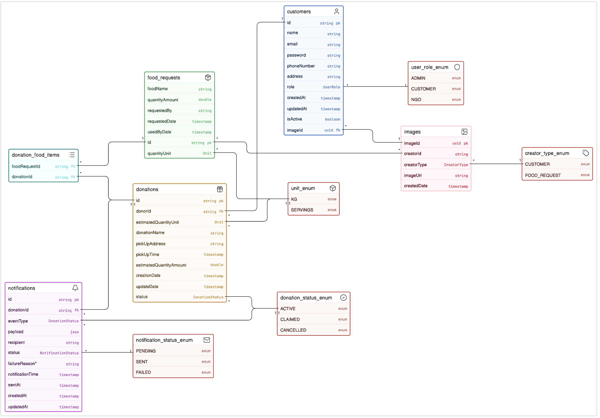

# GreenGrub

GreenGrub is a **cloud-native food donation platform** built with a microservice architecture. It connects food donors with recipients through a scalable backend system deployed on a self-managed Kubernetes cluster on GCP.

---

## Architecture Diagrams

| Diagram | Preview |
|---|---|
| Cloud Architecture |  |
| Local Architecture |  |
| Entity Relationship Diagram |  |

---

## Technology Stack

| Layer | Technology |
|---|---|
| API Gateway | Spring Cloud Gateway WebMVC 5.0.0 |
| Services | Spring Boot 3.x · Java 21 |
| Inter-service communication | gRPC (proto-contracts shared library) |
| Async events | Apache Kafka 3.6 |
| Databases | PostgreSQL 15 · MongoDB |
| Caching / Rate limiting | Redis 7.2 |
| Image storage | Google Cloud Storage |
| Service discovery (local only) | Eureka (Spring Cloud Netflix) |
| Frontend | React 18 + Vite |
| Container orchestration | Kubernetes 1.29 (kubeadm, self-managed on GCP) |
| CI / CD | Jenkins |
| Monitoring | Prometheus + Grafana |
| Logging | Elasticsearch + Logstash + Kibana + Fluent Bit |
| Code quality | SonarQube (80% coverage gate) |

---

## Repositories

The project is split across multiple repositories, each owned by a team member.

| Module | Repository |
|---|---|
| API Gateway | [greengrub/services/gateway](https://github.com/SubhadipJ/greengrub/tree/dev/services/gateway) *(local only)* |
| Customer Service | [GreenGrubUserManagementService](https://github.com/abhishekg323/GreenGrubUserManagementService) |
| Donation Service | [Greengrub-donation-service](https://github.com/RishavRajSingh44/Greengrub-donation-service) |
| Food Request Service | [greengrub-food-request](https://github.com/Antika7/greengrub-food-request) |
| Image Service | [greengrub/services/image-service](https://github.com/SubhadipJ/greengrub/tree/dev/services/image-service) |
| Notification Service | [greengrub/services/notification](https://github.com/SubhadipJ/greengrub/tree/dev/services/notification) |
| Service Discovery | [greengrub/services/discovery](https://github.com/SubhadipJ/greengrub/tree/dev/services/discovery) *(local only)* |
| Proto Contracts | [proto-contracts](https://github.com/greengrub-team/proto-contracts) |
| Frontend (React UI) | [Greengrub-ui-V2](https://github.com/RishavRajSingh44/Greengrub-ui-V2) |
| K8s Scripts | *(part of this repo — `scripts/`)* |

> **Local only** — Gateway and Service Discovery are used when running locally. In Kubernetes, the gateway runs as a deployment and Eureka is disabled (`eureka.client.enabled=false`).

---

## Service Overview

| Service | Description | Port (local) | Database |
|---|---|---|---|
| **API Gateway** | Single entry point — handles CORS, JWT auth, rate limiting, circuit breakers, routes to downstream services | 8080 | — |
| **Customer Service** | User registration, login, profile management | 8082 | PostgreSQL + MongoDB |
| **Donation Service** | Donation creation, management, status tracking | 8083 | PostgreSQL |
| **Food Request Service** | Food request creation and listing | 8081 | PostgreSQL |
| **Image Service** | Image upload/retrieval via Google Cloud Storage | 8085 | GCS |
| **Notification Service** | Consumes Kafka events, sends email notifications | 8084 | — |
| **Service Discovery** | Eureka server for local inter-service discovery | 8761 | — |

---

## Communication Pattern

```
Browser / Mobile
      │
      ▼  REST (HTTP/JSON)
  API Gateway  ──── JWT validation ──── Rate limiting ──── Circuit breakers
      │
      ├──► Customer Service   ──gRPC──► Image Service
      │         └──────────────gRPC──► Donation Service
      │
      ├──► Donation Service   ──Kafka──► Notification Service
      │
      ├──► Food Request Service ──gRPC──► Image Service
      │
      └──► Image Service
```

| Communication | Technology |
|---|---|
| Client → Gateway | REST (JSON) |
| Gateway → Services | HTTP (internal) |
| Service → Service | gRPC |
| Async events | Kafka (donation-created → notification) |
| Caching | Redis |

---

## Project Structure

```
greengrub/
│
├── services/                   # Backend microservices (Subhadip)
│   ├── gateway/                # API Gateway
│   ├── image-service/          # Image upload/retrieval
│   ├── notification/           # Email notifications
│   ├── discovery/              # Eureka (local only)
│   ├── docker-compose.yml      # Local infrastructure (Postgres, Kafka, Redis, ELK…)
│   ├── logstash.conf           # Logstash pipeline config (local)
│   ├── prometheus.yml          # Prometheus scrape config (local)
│   └── localDevSetup.md        # ← Local development guide
│
├── scripts/                    # Kubernetes deployment scripts
│   ├── 00-cluster-setup/       # kubeadm node bootstrap
│   ├── 01-namespaces/          # Namespace creation
│   ├── 02-secrets/             # K8s Secrets (templates — fill before applying)
│   ├── 03-utility/             # Kafka + Redis manifests
│   ├── 04-services/            # ConfigMaps + RBAC for services namespace
│   ├── 05-ingress/             # nginx ingress rules
│   ├── 06-monitoring/          # Prometheus + Grafana Helm values
│   ├── 07-logging/             # ELK + Fluent Bit Helm values
│   ├── 08-dashboards/          # Grafana dashboard JSON exports
│   ├── 09-dashboard/           # Kubernetes Dashboard manifest
│   └── README.md               # ← Full K8s deployment guide
│
├── diagrams/                   # Architecture and ERD diagrams
│   ├── cloud-arch.png          # GCP Kubernetes cluster architecture
│   ├── local-arch.png          # Local Docker Compose architecture
│   └── erd.png                 # Entity Relationship Diagram
│
└── README.md                   # ← You are here
```

Other service repos (cloned separately):
```
GreenGrubUserManagementService/   # Customer service
Greengrub-donation-service/       # Donation service
greengrub-food-request/           # Food request service
Greengrub-ui-V2/                  # React frontend
```

---

## Cloud Deployment (GCP + Kubernetes)

The production environment runs on a **3-node self-managed kubeadm cluster** on GCP:

| Node | Role | Workloads |
|---|---|---|
| `k8s-control-plane` | Control plane | Kubernetes API, etcd, scheduler |
| `k8s-worker-node` | Worker | services, utility, monitoring, ingress-nginx |
| `k8s-elk-node` | Dedicated ELK node | Elasticsearch, Logstash, Kibana, Fluent Bit |

### Access URLs (production)

| Tool | URL |
|---|---|
| Application (via ingress) | `http://<worker-node-ip>` |
| Prometheus | `http://<worker-node-ip>:30090` |
| Grafana | `http://<worker-node-ip>:30300` |
| Kibana | `http://<elk-node-ip>:30601` |
| Elasticsearch | `http://<elk-node-ip>:30920` |
| Kubernetes Dashboard | `https://<any-node-ip>:8551` |

For full deployment instructions see **[scripts/README.md](scripts/README.md)**.

---

## Local Development

For local development, all infrastructure (PostgreSQL, MongoDB, Kafka, Redis, ELK, Prometheus, Grafana) runs via **Docker Compose** while Spring Boot services run from your IDE.

For full setup instructions see **[services/localDevSetup.md](services/localDevSetup.md)**.

Quick start:
```bash
# 1. Start infrastructure
cd services/
docker compose up -d

# 2. Run each service with the local profile (in your IDE or terminal)
SPRING_PROFILES_ACTIVE=local mvn spring-boot:run

# 3. Start the frontend
cd Greengrub-ui-V2/
npm install && npm run dev
# UI available at http://localhost:5173
```

---

## CI / CD

Each service has a **Jenkins pipeline** that:
1. Runs unit tests
2. Checks code coverage via **SonarQube** (minimum 80% required)
3. Builds a Docker image and pushes to **Google Container Registry** (`gcr.io`)
4. Applies the service's `k8s.yaml` to the cluster

---

## Key Features

- **Microservice architecture** — each service is independently deployable
- **gRPC** for low-latency internal service-to-service calls
- **Event-driven** design — Kafka decouples donation events from notifications
- **Circuit breakers** (Resilience4j) on all gateway routes with fallback responses
- **Rate limiting** per client IP at the gateway
- **Centralized CORS** handling at the gateway — downstream services have no CORS config
- **Observability** — metrics (Prometheus + Grafana), logs (ELK + Fluent Bit), cluster UI (k8s dashboard)
- **SonarQube** quality gate enforced on every CI build
